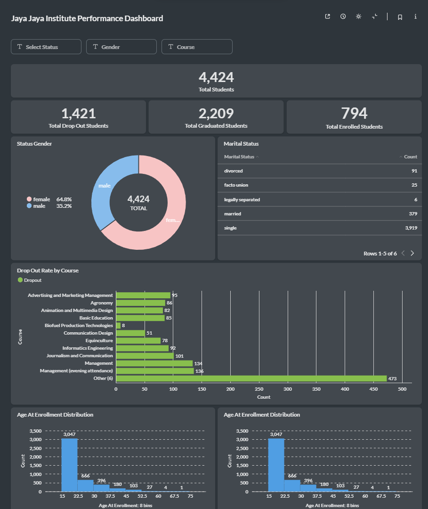

# Student-Performance-Dashboard-Prediction

## Business Understanding
Jaya Jaya Institute adalah salah satu institusi pendidikan perguruan yang telah berdiri sejak tahun 2000. Jaya Jaya Institute dikenal sebagai institusi yang menerima siswa dari berbagai macam kalangan. Institusi pendidikan ini memiliki kelas pagi dan malam dan menyediakan lebih dari 10 pilihan jurusan. 

### Permasalahan Bisnis
Permasalahan bisnis yang dihadapi oleh Jaya Jaya Institute adalah tingginya dropout rate, yang berarti siswa tidak menyelesaikan pendidikannya. Hal ini disebabkan banyaknya jurusan yang harus diawasi dan faktor-faktor lainnya. Hal tersebut mendorong pihak institusi pendidikan untuk mencari tahu penyebab tingginya dropout rate sehingga dapat meminimalisasi kemungkinan terjadinya dropout.

### Cakupan Proyek
1. Menganalisis faktor penyebab tingginya dropout rate
2. Membuat model machine learning dan prediksi sederhana
3. Membangun dashboard menggunakan metabase

### Persiapan

Sumber data: https://github.com/dicodingacademy/dicoding_dataset/tree/main/students_performance

Menginstal package yang dibutuhkan
```
pip install -r requirements.txt
```

## Business Dashboard




## Machine Learning Prediction System
Screenshot 2025-01-30 210248.png

Streamlit link: https://student-performance-dashboard-prediction-vgttrpmhynqmy9sl8nxut.streamlit.app/

## Conclusion
Dari analisis yang dilakukan, dapat disimpulkan bahwa beberapa faktor seperti pembayaran uang kuliah, jumlah unit kurikuler yang disetujui, prestasi akademik, dan status penerima beasiswa sangat mempengaruhi status mahasiswa, terutama dalam hal kemungkinan putus kuliah. Adapun beberapa kesimpulan seperti:
- Sebagian besar dari penerima beasiswa tidak melakukan dropout.
- Sebagian besar siswa berjenis kelamin perempuan.
- Jurusan management memiliki jumlah siswa dropout yang lebih banyak.

### Rekomendasi Action Items
Berikan beberapa rekomendasi action items yang harus dilakukan Jaya Jaya Institute guna menyelesaikan masalah tingginya dropout rate diantaranya sebagai berikut.
- Kaji kurikulum: Tinjau apakah beban studi atau tingkat kesulitan terlalu tinggi untuk siswa.
- Bimbingan akademik: Adakan sesi konsultasi atau tutor tambahan untuk mata pelajaran yang sering menjadi kendala.
- Survei kepuasan siswa: Lakukan survei untuk memahami tantangan siswa di jurusan ini.
